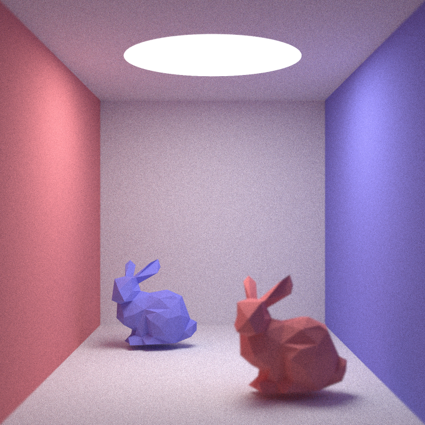
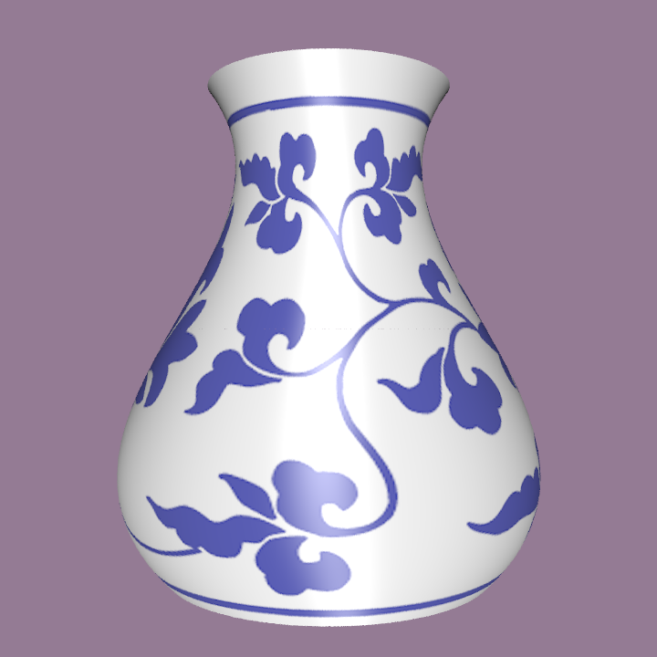
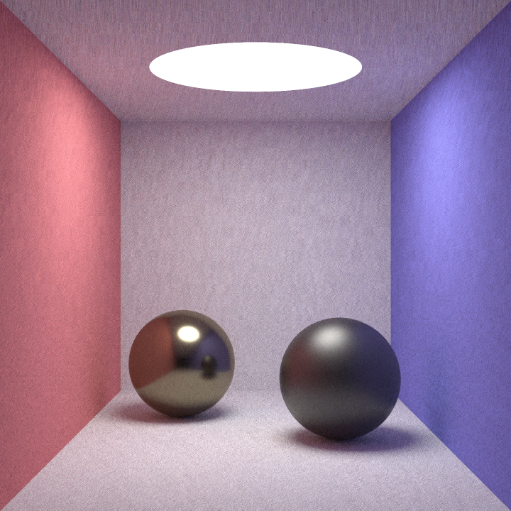

# Photorealistic Rendering Engine

    

## Features

- Whitted-style Ray Tracing

- Monte Carlo Path Tracing (based on `smallpt`)

- Next Event Estimation (`NEE`)

- Glossy Material based on Cook Torrance Model

- Anti-biasing based on `SSAA`

- Hardware Acceleration based on `OPENMP`

- Texture Mapping

- Normal Interpolation

- Field Depth

- AABB Bounding Box

- BSP Tree

- Solve Ray-surface Intersection using Newton’s Method (beta)

- `.obj` File Parser

  

## Results

    Japanese Gate

    Field Depth

    vase

    Glossy Material

## Acknowledgements

- This project is the final coursework for *Foundations of Computer Graphics* in Tsinghua University. Thank professor Hu ,TA Cao and TA Chen for their guidance.
- Monte Carlo Renderer based on  [smallpt: Global Illumination in 99 lines of C++ (kevinbeason.com)](https://www.kevinbeason.com/smallpt/)
- `.obj` file parser from  [thisistherk/fast_obj: Fast C OBJ parser (github.com)](https://github.com/thisistherk/fast_obj)
- `.png` file parser from  [lvandeve/lodepng: PNG encoder and decoder in C and C++. (github.com)](https://github.com/lvandeve/lodepng)

