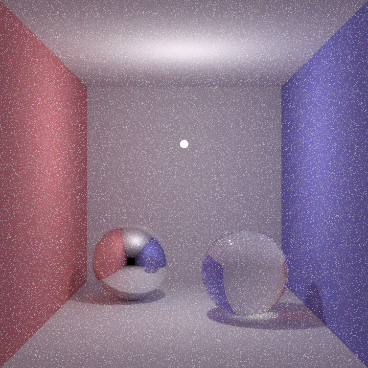
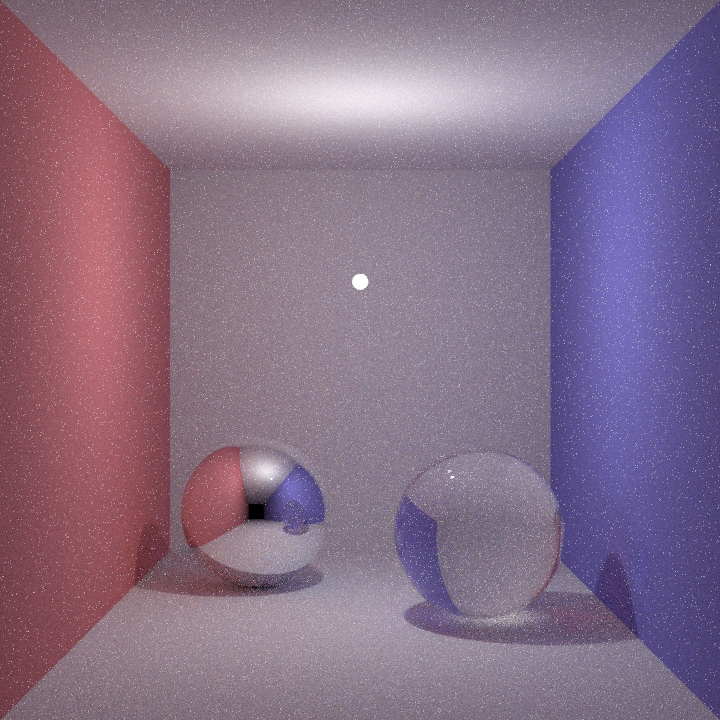
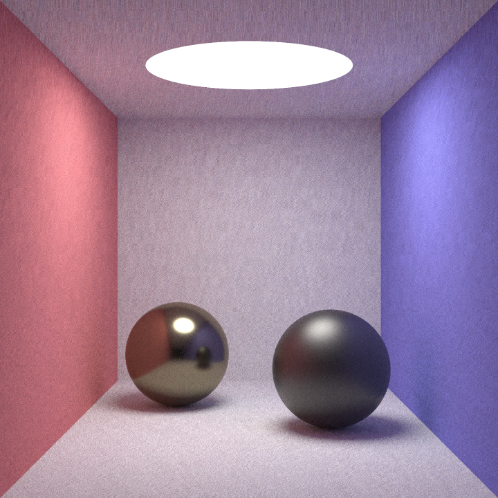
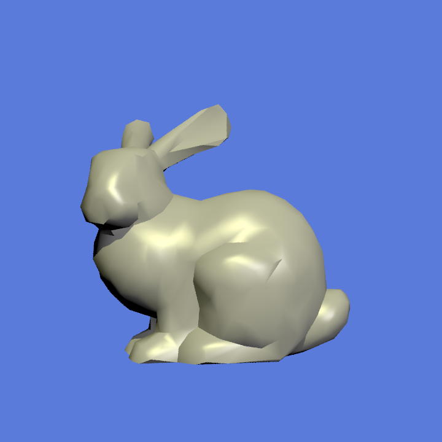
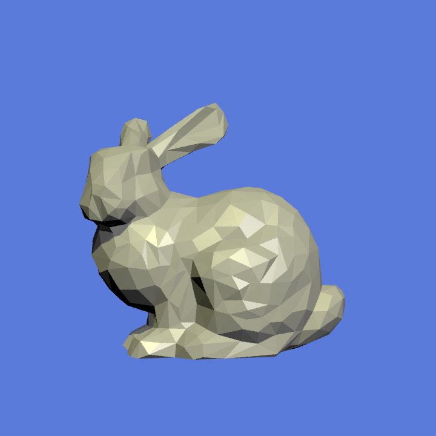
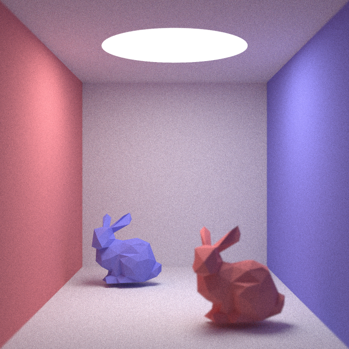
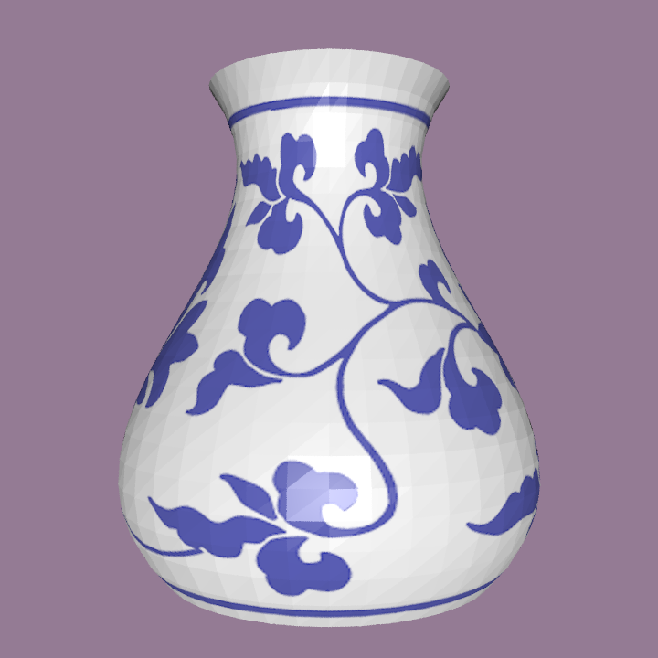

# 真实感渲染 实验报告

付甲申 2022012206


## 渲染结果

场景共`116,198`个面片，分辨率`1920*1920`，渲染时间约`7`小时。(实验所用CPU：`12th Gen Intel(R) Core(TM) i7-12700H   2.30 GHz 	20 Threads`)


场景文件来自 [3D Models Free Download - Open3dModel.com](https://open3dmodel.com/)


## 基础功能实现

实现了Whitted-style光线追踪，支持反射、折射和阴影。基于`smallpt`实现了路径追踪，支持面光源，漫反射，理想反射，折射，glossy材质等。并且针对方向光源、点光源、球面光源做了`NEE`。

### 效果对比

下图展示了使用`NEE`与未使用`NEE`的收敛速度对比，可以明显看出`NEE`对收敛的加速作用。

<div align="center">     
    
    
</div>

<div align='center'>
    左图未使用NEE，采样数为100；右图使用NEE，采样数为16
</div>
### 具体逻辑

#### `Whitted-style` 渲染器逻辑

基本参照课堂内容实现，代码中有详尽的注释。

```c++
/**
 * Whitted-style ray tracing.
 * @author Jason Fu
 */
class WhittedRenderer : public Renderer {

public:

    WhittedRenderer(SceneParser *parser, std::string outputFile, int samples, int max_depth = 5)
            : Renderer(parser, std::move(outputFile), samples), maxDepth(max_depth) {}

    /**
    * Whitted-style ray tracing.
    * @param group objects in the scene
    * @param ray ray from camera to point on the screen
    * @param lights light sources
    * @param backgroundColor
    * @param weight
    * @param depth
    * @return ultimate color for the ray
    * @author Jason Fu
    */
    Vector3f intersectColor(Group *group, Ray ray, std::vector<Light *> &lights, Vector3f backgroundColor, float weight, int depth) override {
        if (weight < MIN_WEIGHT || depth == maxDepth)
            return Vector3f::ZERO;

        Hit hit;
        // 求交
        bool intersect = group->intersect(ray, hit, DISTURBANCE);
        // 如果有交点
        if (intersect) {
            // 累加所有光源的影响
            Vector3f finalColor = Vector3f::ZERO;
            Material *material = hit.getMaterial();
            bool is_inside = hit.isInside();
            for (auto light: lights) {
                Vector3f L, lightColor;
                // 获得光照强度
                light->getIllumination(ray.pointAtParameter(hit.getT()), L, lightColor);
                // 计算局部光强（如果不是在物体内部，且不是在阴影中）
                if (!light->isInShadow(ray.pointAtParameter(hit.getT()), group, -L))
                    finalColor += material->Shade(ray, hit, L, lightColor);
            }
            // 递归计算反射光
            if (material->isReflective()) {
                Ray *reflectionRay = reflect(ray, hit.getNormal(), 
                              ray.pointAtParameter(hit.getT() - DISTURBANCE));
                finalColor += material->getReflectiveCoefficient() *
                      intersectColor(group, *reflectionRay, lights, backgroundColor,
                          material->getReflectiveCoefficient() * weight, depth + 1);
                delete reflectionRay;
            }
            // 递归计算折射光
            if (material->isRefractive()) {
                // 注意判断光线是否在物体内部
                float n1 = (is_inside) ? material->getRefractiveIndex() : 1;
                float n2 = (is_inside) ? 1 : material->getRefractiveIndex();
                // 折射光
                Ray *refractionRay = refract(ray, hit.getNormal(), 
                          ray.pointAtParameter(hit.getT() + DISTURBANCE), n1, n2);

                if (refractionRay != nullptr) { // 若不发生全反射
                    finalColor += material->getRefractiveCoefficient() *
                      intersectColor(group, *refractionRay, lights, backgroundColor,
                         material->getRefractiveCoefficient() * weight, depth + 1);
                }

                delete refractionRay;
            }
            return finalColor;
        } else {
            return backgroundColor;
        }

    }

private:
    int maxDepth;
};
```

#### `Monte-Carlo` 渲染器逻辑

基于`smallpt`实现，代码中有详尽的注释。

```c++
/**
 * Monte-Carlo raytracing, cos-weighted sampling, RR termination. Based on smallpt
 * @acknowledgement : Kevin Beason
 * @author : Jason Fu (整合)
 */
class MonteCarloRenderer : public Renderer {
public:
    MonteCarloRenderer(SceneParser *parser, std::string outputFile, int num_samples)
            : Renderer(parser, std::move(outputFile), num_samples) {}

    /**
    * ACKNOWLEDGEMENT : Kevin Beason
    */
    Vector3f intersectColor(Group *group, Ray ray, std::vector<Light *> &lights, 
        Vector3f backgroundColor, float weight, int depth) override {
        Hit hit;
        // 求交
        bool intersect = group->intersect(ray, hit, DISTURBANCE);
        if (!intersect) return backgroundColor; // 未相交则返回背景色
        Material *material = hit.getMaterial();
        int type = material->getType();
        Vector3f color = material->Shade(ray, hit, Vector3f::ZERO, Vector3f::ZERO);
        Vector3f e_color = material->getEmissionColor();
        Vector3f final_color = Vector3f::ZERO;
        float p = std::max(color.x(), std::max(color.y(), color.z())) / 1.25;
        // 根据RR决定是否终止(5层递归之后才开始判断)
        if (++depth > 5) {
            if (uniform01() < p) { // 越亮的物体计算次数越多
                color = color / p;
            } else {
                return e_color;
            }
        }

        // 判断材料类型
        if (type == Material::DIFFUSE) { // 漫反射
            // 随机生成一个漫反射曲线
            float r1 = 2 * M_PI * uniform01();
            float r2 = uniform01(), r2s = std::sqrt(r2);
            // 生成正交坐标系 (w, u, v)
            Vector3f w = hit.getNormal();
            Vector3f u = (Vector3f::cross((std::fabs(w.x()) > 0.1 
               ? Vector3f(0, 1, 0) : Vector3f(1, 0, 0)), w)).normalized();
            Vector3f v = Vector3f::cross(w, u).normalized();
            // 生成漫反射曲线
            Vector3f dir = (u * std::cos(r1) * r2s 
                            + v * std::sin(r1) * r2s 
                            + w * std::sqrt(1 - r2)).normalized();
            Ray rfl_ray = Ray(ray.pointAtParameter(hit.getT() - DISTURBANCE), dir);
            // 对光源采样（NEE）
            Vector3f nee_color = Vector3f::ZERO;
            for (Light *light: lights) {
                Vector3f ldir, lc;
                // 计算光源方向和颜色
                light->getIllumination(ray.pointAtParameter(hit.getT()), ldir, lc);
                // 计算光源是否被遮挡
                if (!light->isInShadow(ray.pointAtParameter(hit.getT()), group, -ldir)) {
                    nee_color += lc * 
                       std::max(Vector3f::dot(ldir, hit.getNormal()), 0.0f);
                }
            }
            // 递归
            final_color = e_color +
                     color * (nee_color + intersectColor(group, rfl_ray, lights, 
                                        backgroundColor, weight, depth));
        } else if (type == Material::SPECULAR) { // 镜面反射
            // 生成反射光线
            Ray *rfl_ray = reflect(ray, hit.getNormal(), 
                                  ray.pointAtParameter(hit.getT() - DISTURBANCE));
            final_color = e_color + color * intersectColor(group, 
                            *rfl_ray, lights, backgroundColor, weight, depth);
            delete rfl_ray;
        } else if (type == Material::TRANSPARENT) { // 折射
            // 注意判断光线是否在物体内部
            bool is_inside = hit.isInside();
            float n1 = (is_inside) ? material->getRefractiveIndex() : 1;
            float n2 = (is_inside) ? 1 : material->getRefractiveIndex();
            // 折射光
            Ray *rfr_ray = refract(ray, hit.getNormal(), 
                       ray.pointAtParameter(hit.getT() + DISTURBANCE), n1, n2);
            // 反射光
            Ray *rfl_ray = reflect(ray, hit.getNormal(), 
                       ray.pointAtParameter(hit.getT() - DISTURBANCE));
            if (rfr_ray == nullptr) { // 发生全反射
                final_color =
                        e_color + color * intersectColor(group, 
                                *rfl_ray, lights, backgroundColor, weight, depth);
            } else { // 根据菲涅尔反射函数计算
                double a = (n1 > n2) ? (n1 / n2 - 1) : (n2 / n1 - 1);
                double b = (n1 > n2) ? (n1 / n2 + 1) : (n2 / n1 + 1);
                double R0 = (a * a) / (b * b);
                double c = 1 - (is_inside 
                   ? std::fabs(Vector3f::dot(rfr_ray->getDirection(), hit.getNormal()))
                   : std::fabs(Vector3f::dot(ray.getDirection(), hit.getNormal())));
                double Re = R0 + (1 - R0) * std::pow(c, 5);
                if (depth > 2) { // 两层递归后，使用RR
                    double P = 0.25 + 0.5 * Re;
                    if (uniform01() < P)
                        final_color = e_color +
                                      color *
                                      intersectColor(group, *rfl_ray, lights, 
                                      backgroundColor, weight, depth) * Re / P;
                    else
                        final_color = e_color +
                                      color *
                                      intersectColor(group, *rfr_ray, lights, 
                                      backgroundColor, weight, depth) *
                                      (1 - Re) / (1 - P);

                } else { // 递归深度较浅时，使用两次递归
                    final_color = e_color
                                  + color * intersectColor(group, *rfl_ray, lights, 
                                   backgroundColor, weight, depth) * Re
                                  + color * intersectColor(group, *rfr_ray, lights, 
                                   backgroundColor, weight, depth)
                                    * (1 - Re);
                }
            }
            delete rfl_ray;
            delete rfr_ray;
        }
        return final_color;
    }

};
```

#### `NEE` 采样逻辑

这里只展示对于球面光源的采样代码。

```c++
// NOTE : the color it returns should be multiplied by <dir, normal> externally
    void getIllumination(const Vector3f &p, Vector3f &dir, Vector3f &col) const override {
        // construct (w, u, v)
        Vector3f w = (position - p).normalized();
        Vector3f u = Vector3f::cross((std::fabs(w.x()) > 0.1 
                     ? Vector3f(0, 1, 0) : Vector3f(1, 0, 0)), w).normalized();
        Vector3f v = Vector3f::cross(w, u).normalized();
        float cos_theta_max = std::sqrt(1 - (radius * radius) 
                             / Vector3f::dot(position - p, position - p));
        // Randomly generate the ray
        float eps1 = uniform01(), eps2 = uniform01();
        float cos_theta = 1 - eps1 + eps1 * cos_theta_max;
        if (cos_theta > 1) // illegal
        {
            dir = Vector3f::ZERO;
            col = Vector3f::ZERO;
            return;
        }
        float sin_theta = std::sqrt(1 - cos_theta * cos_theta);
        float phi = 2 * M_PI * eps2;
        dir = u * std::cos(phi) * sin_theta 
            + v * std::sin(phi) * sin_theta + w * cos_theta;
        dir = dir.normalized();
        /* 
        2 * PI * (1 - cos_theta_max) = 1 / p,  
        1 / PI is the requirement of BRDF material
        */
        col = emissionColor * 2 * M_PI * (1 - cos_theta_max) * M_1_PI;
    }
```

#### glossy材质逻辑

验收的时候没写glossy材质，所以这里把图给补上。



glossy材质基于`Cook Torrance Model`实现，分布选用`GGX`，菲涅尔项和几何衰减项均使用`Schlick`法近似。这里展示该模型的代码：

```c++
/**
 * Cook Torrance Model for Glossy Material
 * @author Jason Fu
 * @acknowledgement BRDF章节PPT
 * 
 */
class CookTorranceMaterial : public Material {
public:
    explicit CookTorranceMaterial(const Vector3f& d_color, float s, float d, float m, const Vector3f& F0)
            : Material(d_color, 0.0, 0.0, 0.0) {
        this->m = m;
        this->s = s;
        this->d = d;
        this->F0 = F0;
        this->type = MaterialType::GLOSSY;
    }

    CookTorranceMaterial(const CookTorranceMaterial &m) : Material(m) {
        this->m = m.m;
        this->s = m.s;
        this->d = m.d;
        this->F0 = m.F0;
        this->type = MaterialType::GLOSSY;
    }

    Vector3f Shade(const Ray &ray, const Hit &hit, const Vector3f &dirToLight, const Vector3f &lightColor) override;

    Vector3f CookTorranceBRDF(const Vector3f &L, const Vector3f &V, const Vector3f &N) const {
        // half vector
        Vector3f H = (L + V).normalized();
        // Fresnel
        Vector3f F = fresnelSchlick(H, V);
        // distribution
        float D = distributionGGX(N, H);
        // geometry
        float G = geometrySmith(N, V, L);

        auto specular = (D * F * G) / (4 *
                    std::max(Vector3f::dot(N, V), 0.0f) *
                    std::max(Vector3f::dot(N, L), 0.0f) + 0.001f
                );

        return (d * diffuseColor + s * specular);
    }


    /**
     * Calculate the Fresnel Reflection Coefficient
     */
    Vector3f fresnelSchlick(const Vector3f &H, const Vector3f &V) const{
        float hv = std::max(Vector3f::dot(H, V), 0.0f);
        return F0 + (1 - F0) * pow(1 - hv, 5);
    }

    /**
     * GGX Distribution
     */
    float distributionGGX(const Vector3f &N, const Vector3f &H) const {
        float a2 = m * m;
        float nh = std::max(Vector3f::dot(N, H), 0.0f);
        float b = nh * nh * (a2 - 1) + 1;
        return a2 / (M_PI * b * b);
    }

    /**
     * Geometry Smith Method
     */
    float geometrySmith(const Vector3f &N, const Vector3f &V, const Vector3f &L) const {
        return geometrySchlickGGX(N, V) * geometrySchlickGGX(N, L);
    }

    /**
     * Geometry Schlick-GGX Method
     */
    float geometrySchlickGGX(const Vector3f &N, const Vector3f &V) const {
        float k = (m + 1) * (m + 1) / 8;
        float nv = std::max(Vector3f::dot(N, V), 0.0f);
        return nv / (nv * (1 - k) + k);
    }

    /**
     * Sampling in the GGX Hemisphere
     */
    Vector3f sampleGGXHemisphere(const Vector3f &N) {
        float r1 = uniform01();
        float r2 = uniform01();

        float a = m * m;
        float phi = 2 * M_PI * r1;
        float cosTheta = std::sqrt((1.0 - r2) / (1.0 + (a * a - 1.0) * r2));
        float sinTheta = std::sqrt(1.0 - cosTheta * cosTheta);

        // Convert to Cartesian coordinates
        Vector3f H;
        H.x() = sinTheta * std::cos(phi);
        H.y() = sinTheta * std::sin(phi);
        H.z() = cosTheta;

        // Transform to world space
        Vector3f up = (std::fabs(N.z()) < 0.999) ? 
            Vector3f(0.0, 0.0, 1.0) : Vector3f(1.0, 0.0, 0.0);
        Vector3f tangentX = Vector3f::cross(up, N).normalized();
        Vector3f tangentY = Vector3f::cross(N, tangentX);

        return (tangentX * H.x() + tangentY * H.y() + N * H.z()).normalized();
    }


protected:
    float s;  // specular coefficient
    float d;  // diffuse coefficient
    float m;  // roughness
    Vector3f F0; // Fresnel coefficient


};
```


## 附加功能实现

### 抗锯齿 

抗锯齿方法使用SSAA（Supersampling Anti-Aliasing），对每一个像素采样2*2的子像素，最后取平均。受`smallpt`启发，采样时使用`tent filter`，即基于函数
$$
f(x) = \begin{cases}
 \sqrt{x} - 1 \ \ \ &0 \leq   x  < 1 \\
 1-\sqrt{2-x} &1 \leq x \leq 2
\end{cases}
$$
随机射出光线，x是[0, 2]内的随机数。

```c++
// anti-aliasing using 2*2 subpixel
for (int sx = 0; sx < 2; sx++) {
     for (int sy = 0; sy < 2; sy++) {
          Vector3f sample_color = Vector3f::ZERO;
          for (int i = 0; i < samples; i++) {
              // use tent filter (inspired by smallpt)
              double r1 = 2 * uniform01();
              double r2 = 2 * uniform01();
              double dx = (r1 < 1) ? sqrt(r1) - 1 : 1 - sqrt(2 - r1);
              double dy = (r2 < 1) ? sqrt(r2) - 1 : 1 - sqrt(2 - r2);
              Ray camRay = camera->generateRay(Vector2f(x + (sx + dx) / 2.0, 
                                                        y + (sy + dy) / 2.0));
              // whitted-style ray tracing
              sample_color += intersectColor(group, camRay, lights, 
                                             parser->getBackgroundColor(), 1, 0)
                                            * (1.0 / samples);
          }
          color += clamp(sample_color, 0.0, 1.0) * 0.25;
    }
}
```


### 纹理贴图 

纹理贴图主要的难点在于针对不同几何体实现纹理映射。

#### 平面

在平面上取一点建立xOy坐标系，将纹理坐标直接映射到该坐标系中。对于超出长宽范围的坐标，返回取模后的结果。

```c++
std::pair<int, int>
textureMap(float objectX, float objectY, float objectZ, int textureWidth, int textureHeight) override {
    // compress the image
    double newWidth = textureWidth * scale;
    double newHeight = textureHeight * scale;
    // calculate the coordinate (x, y) on the plane
    Vector3f dir = Vector3f(objectX, objectY, objectZ) - origin;
    double length = dir.length();
    double cos_theta = Vector3f::dot(dir, _u) / length;
    double sin_theta = Vector3f::dot(dir, _v) / length;
    double x = length * cos_theta;
    double y = length * sin_theta;
    // convert
    double u = mod(x, newWidth) / newWidth;
    double v = mod(y, newHeight) / newHeight;
    // convert it to the texture coordinate
    return std::make_pair(std::floor(u * textureWidth), std::floor(v * textureHeight));
}
```

#### 球体

计算一点的经度及纬度，作为贴图的uv坐标。

```c++
std::pair<int, int>
textureMap(float objectX, float objectY, float objectZ, int textureWidth, int textureHeight) override {
    double x = objectX - _center.x();
    double y = objectY - _center.y();
    double z = objectZ - _center.z();
    double theta = std::atan2(z, x) + theta_offset; // xOz平面
    double phi = std::acos(y / _radius) + phi_offset; // y轴方向
    double u = mod((M_PI + theta) / (2 * M_PI), 1);
    double v = mod((M_PI - phi) / M_PI, 1);
    return std::make_pair((int) (u * textureWidth), (int) (v * textureHeight));
}
```

#### 旋转曲面

与球体（一类特殊的旋转曲面）类似，算出旋转参数$\theta$和曲线参数$\mu$，作为贴图的uv坐标。

```c++
std::pair<int, int>
textureMap(float objectX, float objectY, float objectZ, int textureWidth, int textureHeight) override {
    // calculate the texture coordinate
    float theta = std::atan2(objectX, objectZ) + M_PI;
    float mu = (objectY - curve_y_min) / (curve_y_max - curve_y_min);
    return {int(theta / (2 * M_PI) * textureWidth), int(mu * textureHeight)};
}
```

#### 三角面片

首先从`.obj`文件中获取顶点的uv坐标，再根据重心坐标系算出三角形中一点的uv坐标。

1.  求交后uv坐标计算

```c++
float alpha = 1 - beta - gamma;
u = mod(alpha * au + beta * bu + gamma * cu, 1);
v = mod(alpha * av + beta * bv + gamma * cv, 1);
```

2. 纹理映射函数

```c++
pair<int, int>
textureMap(float objectX, float objectY, float objectZ, int textureWidth, int textureHeight) override {
    return {
            std::floor(u * textureWidth),
            std::floor(v * textureHeight)
    };
}
```

同时，三角面片支持**透射效果**。即对应像素的`alpha`通道值（透明度）小于一定阈值时，认为与该三角面片没有交点，继续进行求交。（详见渲染结果部分的树叶效果）


### 法向插值

若光线与三角面片有交点，其法向量按如下规则计算：
$$
\vec n' = \alpha \vec n_a + \beta \vec n_b + \gamma \vec n_c
$$
其中，$(\alpha, \beta, \gamma)$为该点的重心坐标，$\vec n_a, \vec n_b, \vec n_c$分别为三个顶点处的法向量。

<div align='center'>
    
    
</div>

<div align='center'>
    法向插值（左）与不插值（右）效果对比，法向插值使着色更平滑
</div>


### 景深

利用相机物理成像原理实现景深效果：增加**“光圈”**和**“焦平面”**两个参数，射出光线时，保持焦平面上的点不动，在光圈上随机采样作为光线射出点。这样，不在焦平面上的物体将模糊，而位于焦平面附近的物体受影响较小。



<div align='center'>
    景深效果，能够明显看到前面的光源和兔子比后面的模糊
</div>

```c++
/**
 * A camera based on the pin-hole model.
 * @author Jason Fu
 */
class PerspectiveCamera : public Camera {

public:
    PerspectiveCamera(const Vector3f &center, const Vector3f &direction,
                      const Vector3f &up, int imgW, int imgH, float angle,
                      float _aperture = 0.0f, float _focus_plane=1.0f) 
        : Camera(center, direction, up, imgW, imgH) {
        // angle is in radian.
        aperture = _aperture;
        focus_plane = _focus_plane;
        // unit num pixels in camera space
        fx = imgW / (2.0f * std::tan(angle / 2.0f) * focus_plane);
        fy = imgH / (2.0f * std::tan(angle / 2.0f) * focus_plane);
    }

    Ray generateRay(const Vector2f &point) override {
        // randomly generate a ray in the aperture, while leave the focus
        // point unchanged
        auto p = randomPointInCircle(aperture);
        Vector3f focusPoint = 
            Vector3f((point.x() - width / 2.0f) / fx, 
                     (point.y() - height / 2.0f) / fy,  focus_plane);
        Vector3f ORc = Vector3f(p.first, p.second, 0);
        Vector3f dRc = (focusPoint - ORc).normalized();
        // to the world space
        Vector3f ORw = center + horizontal * p.first - up * p.second;
        Matrix3f R = Matrix3f(horizontal, -up, direction);
        Vector3f dRw = (R * dRc).normalized();
        return Ray(ORw, dRw);
    }

private:
    float fx;
    float fy;
    float aperture;
    float focus_plane;
};
```


### 求交加速

#### AABB包围盒

对于三角面片组`mesh`和旋转曲面`revsurface`，建立AABB包围盒。求交时先与包围盒求交，有交点后才与其中的物体求交。

#### BSP Tree (Kd Tree)

对于三角面片组`mesh`建立kd树。

##### 构建逻辑

当前三角形的数目少于`LEAF_SIZE`时，建立叶节点。否则，找到所有三角形中对应坐标轴中最小坐标的中位数，执行二分。若二分失败，也建立叶节点。

```c++
// left : lb <= pivot
// right : ub > pivot
BSPTree::Node *BSPTree::construct(std::vector<Object3D *> &objects, int axis) {
    int n = objects.size();
    if (n <= LEAF_SIZE) {
        // stop recursion
        if (n <= 0)
            return nullptr;
        // otherwise, create a leaf node
        Node *leaf = new Node(axis, 0, n);
        leaf->objects = new Object3D *[n];
        for (int i = 0; i < n; i++) {
            leaf->objects[i] = objects[i];
            size += 1;
        }
        return leaf;
    }
    // otherwise, create a non-leaf node
    int median = n / 2;
    // select the pivot
    std::nth_element(objects.begin(), objects.begin() + median, objects.end(),
                     [axis](Object3D *a, Object3D *b) {
                         return a->getLowerBound(axis) < b->getLowerBound(axis);
                     });
    auto pivot = objects[median]->getLowerBound(axis);
    // split
    std::vector<Object3D *> left, right;
    for (auto &obj: objects) {
        if (obj->getLowerBound(axis) <= pivot) {
            left.push_back(obj);
        }
        if (obj->getUpperBound(axis) > pivot) {
            right.push_back(obj);
        }
    }
    if (left.size() == n || right.size() == n) {
        // if all objects are in the same side, create a leaf node
        Node *leaf = new Node(axis, 0, n);
        leaf->objects = new Object3D *[n];
        for (int i = 0; i < n; i++) {
            leaf->objects[i] = objects[i];
            size++;
        }
        return leaf;
    }
    // construct
    Node *lc = construct(left, (axis + 1) % 3);
    Node *rc = construct(right, (axis + 1) % 3);
    Node *node = new Node(axis, pivot, 0);
    node->lc = lc;
    node->rc = rc;
    return node;
}
```

##### 求交逻辑

对于叶节点直接逐个求交。对于内部节点，计算光线与划分超平面交点的`t`值，若`t>tmax`，只需与距光源较近的节点求交；若`t<tmin`，只需与距光源较远的节点求交；其余情况，需与两个子节点求交。

```c++
bool BSPTree::intersect(BSPTree::Node *node, const Ray &r, Hit &h, float tmin, float tmax) {
    bool isIntersect = false;
    if (node) {
        // leaf node
        if (node->size > 0) {
            for (int i = 0; i < node->size; i++) {
                isIntersect |= node->objects[i]->intersect(r, h, tmin);
            }

            return isIntersect;
        }
        // non-leaf node, first calculate distance
        float t = r.parameterAtPoint(node->split, node->axis);
        // then judge the near and far side
        Node *near = node->lc, *far = node->rc;
        if (node->axis == Ray::X_AXIS && r.getOrigin()[Ray::X_AXIS] > node->split) {
            near = node->rc;
            far = node->lc;
        } else if (node->axis == Ray::Y_AXIS && r.getOrigin()[Ray::Y_AXIS] > node->split) 
        {
            near = node->rc;
            far = node->lc;
        } else if (node->axis == Ray::Z_AXIS && r.getOrigin()[Ray::Z_AXIS] > node->split) 
        {
            near = node->rc;
            far = node->lc;
        }

        // finally calculate intersection
        if (t > tmax + TOLERANCE || t < -TOLERANCE)
            isIntersect |= intersect(near, r, h, tmin, tmax);
        else if (t < tmin - TOLERANCE)
            isIntersect |= intersect(far, r, h, tmin, tmax);
        else {
            // intersect with both nodes
            isIntersect |= intersect(near, r, h, tmin, t);
            isIntersect |= intersect(far, r, h, t, tmax);
        }
    }
    return isIntersect;
}
```

##### 效果

以面片数为`1k`的斯坦福兔子为例，快了大约10倍。


### 参数曲面解析求交

受PA2习题课启发，对于射线与曲面相交的事件，可以列出方程：
$$
t_r = \frac{x(t)sin\theta - o_x}{d_x}
= \frac{x(t)cos\theta - o_z}{d_z}
= \frac{y(t)-o_y}{d_y}
$$
整理后转化为以下函数的求零点问题（这里加了个平方，以增加函数本身取值的影响）
$$
f(t) = ((y(t)-o_y)d_z/d_y + o_z)^2 + ((y(t)-o_y)d_x/d_y + o_x)^2 - x(t)^2 )^2
$$
随后可以利用牛顿法解决
$$
t = t - \mu * f/f'
$$
其中$\mu$为超参数，程序中取为0.1。

牛顿法迭代的初值设为$t$能够取到的最小值和最大值，再从得到的解中筛选离光源最近的那个。

最后根据
$$
\vec n  = (cos_\theta, 0, -sin_\theta) \times
(x'(t), y'(t), 0)
$$
计算法向量。

<div align='center'>
    
    
</div>

<div align='center'>
    参数求交（左）与三角网络（右）效果对比，可以明显看出左图的平滑性
</div>


```c++
/**
 * Intersect with the revsurface using Newton's method
 * @author Jason Fu
 *
 */
bool intersect(const Ray &r, Hit &h, float tmin) override {
    // intersect with the bounding box
    float tmax = 1e38;
    if (bBox->isIntersect(r, tmin, tmax)) {
        //find t0
        float t0 = pCurve->min_t, t1 = pCurve->max_t, tr = -1;
        Curve::CurvePoint finalP;
        // newton 1
        if (Newton(r, t0)) {
            Curve::CurvePoint cp;
            pCurve->getDataAt(t0, cp);
            float t = (cp.V.y() - r.getOrigin().y()) 
                / r.getDirection().y();
            if (t > tr) {
                tr = t;
                finalP = cp;
            }
        }
        // newton 2
        if (Newton(r, t1)) {
            Curve::CurvePoint cp;
            pCurve->getDataAt(t1, cp);
            float t = (cp.V.y() - r.getOrigin().y()) 
                / r.getDirection().y();
            if (tr < 0 || t < tr) {
                tr = t;
                finalP = cp;
            }
        }
        if (tr > tmin) {
            // calculate the point at t0
            float t = tr;
            if (t > tmin) {
                // calculate tangent
                // tangent on zOx
                auto p = r.pointAtParameter(t);
                float sin_theta = t * r.getDirection().x() 
                    + r.getOrigin().x();
                float cos_theta = t * r.getDirection().z() 
                    + r.getOrigin().z();
                Vector3f u(cos_theta, 0, -sin_theta);
                // tangent on xOy
                Vector3f v(finalP.T.x(), finalP.T.y(), 0);
                // normal
                Vector3f n = Vector3f::cross(u, v).normalized() 
                    * direction;
                // save to hit
                h.set(t, material, n, false);
                return true;
            }
        }
    }
    return false;
}

/**
 * Find the intersection point of the ray with the surface using Newton iteration.
 * @param r the ray
 * @param t the parameter on the xy-curve, the original number is t0.
 * @return whether the iteration converges.
 * @author Jason Fu
 */
bool Newton(const Ray &r, float &t) {
    int iter = 0;
    while (iter < GN_MAX_ITER) {
        // calculate f df
        float f, df;
        fdf(r, t, f, df);
        // judge if the iteration converges
        if (f < GN_ERROR) {
            return true;
        } else {
            // update t
            t = clamp(t - GN_STEP * f / df, 
                      pCurve->min_t, pCurve->max_t);
        }
        ++iter;
    }
    return false;
}
/**
 * Target function : f(t) = ((y(t)-oy)dz/dy + oz)^2 + ((y(t)-oy)dx/dy + ox)^2 - x(t)^2 )^2
 * @param r
 * @param t
 * @return f(t), df(t)
 * @author Jason Fu
 * @acknowledgement PA2 习题课
 */
inline void fdf(const Ray &r, float t, float &f, float &df) {
    Curve::CurvePoint cp;
    pCurve->getDataAt(t, cp);
    float xt = cp.V.x();
    float yt = cp.V.y();
    float dxt = cp.T.x();
    float dyt = cp.T.y();
    float ox = r.getOrigin().x();
    float oy = r.getOrigin().y();
    float oz = r.getOrigin().z();
    float dx = r.getDirection().x();
    float dy = r.getDirection().y();
    float dz = r.getDirection().z();
    // calculate f
    float a = (yt - oy) * dz / dy + oz;
    float b = (yt - oy) * dx / dy + ox;
    f = a * a + b * b - xt * xt;
    // calculate df
    df = 2 * f * (2 * a * dyt * dz / dy + 2 * b * dyt * dx / dy 
                  - 2 * xt * dxt);
    f = f * f;
}
```


### 硬件加速

简单地基于`OPENMP`调用多线程加速。


## 参考代码

- 渲染器主要实现参考 [smallpt: Global Illumination in 99 lines of C++ (kevinbeason.com)](https://www.kevinbeason.com/smallpt/)
- `.obj`文件解析参考 [thisistherk/fast_obj: Fast C OBJ parser (github.com)](https://github.com/thisistherk/fast_obj)
- `.png`文件解析参考 [lvandeve/lodepng: PNG encoder and decoder in C and C++. (github.com)](https://github.com/lvandeve/lodepng)

### 代码标注声明

- 代码中标注`@author : Jason Fu`（本人英文名）的代码为独立实现。
- 用`@acknowledgement`标注的代码为参考实现，参考源为标注之后的内容。
- 用`@copybrief`及`@copydetail`标注的代码为完全复用（由课程提供的代码也采用了此种标注）。